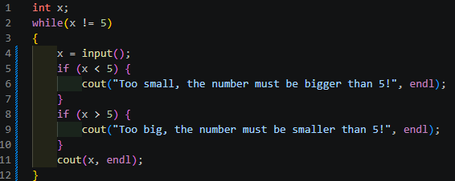

# isi README

This is the README for your extension "isi". After writing up a brief description, we recommend including the following sections.

## Features

Describe specific features of your extension including screenshots of your extension in action. Image paths are relative to this README file.

Basic syntax:

## Known Issues

None

## Release Notes

### 1.0.0

Support for ISI 0.2.
